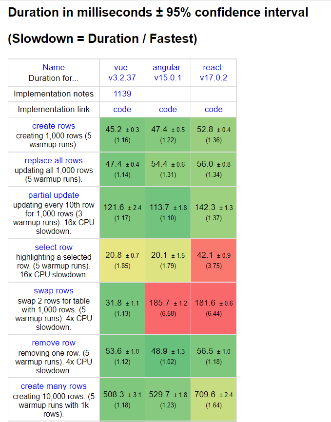
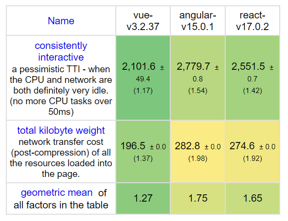

# Почему разработчики выбирают Vue

Для разработки Single Page Applications (одностраничных приложений) необходимо освоить один из современных фреймворков: [Vue](https://vuejs.org/), [React](https://reactjs.org/) или [Angular](https://angular.io/). Рассмотрим ключевые отличия между ними и разберём преимущества Vue.

> Vue, React и Angular принято называть «большой тройкой» фреймворков. Однако набирают популярность и другие инструменты: Svelte, Qwik, Solid.

*   **React** — UI-библиотека.
*   **Vue** — прогрессивный фреймворк, расширяемый дополнительными пакетами.
*   **Angular** — полноценный фреймворк с комплексным набором инструментов.

### Популярность и поддержка

Один из способов оценить популярность — посмотреть количество звёзд на GitHub.

**Vue** разработан Эваном Ю, бывшим инженером Google. Проект поддерживается открытым сообществом и насчитывает более 197 000 звёзд и 32 300 форков. Среди известных продуктов на Vue: Zoom, Nintendo, GitLab, Wizzair.

**React** разработан в Facebook (Meta). Библиотека поддерживается сообществом и корпорацией. На GitHub — более 189 000 звёзд и 39 000 форков. Среди крупных проектов на React: AirBnB, Nike, Udemy.

**Angular 2+** создан и развивается в Google — 81 800 звёзд и 21 600 форков. Angular используется в YouTube TV, PayPal, Gmail.

По количеству звёзд Vue и React идут практически вровень. Однако по числу разработанных продуктов лидирует React.

### Количество вакансий

**Vue** фигурирует примерно в 25% вакансий для разработчиков с опытом 1–3 года и в 15% вакансий для специалистов от трёх лет.

**React** указан в ~50% вакансий для фронтенд-разработчиков с опытом 1–3 года и в 64–69% вакансий для более опытных специалистов.

**Angular** требуется в 21% вакансий для junior/middle-разработчиков и в 27–30% — для senior-позиций.

По этим данным, React уверенно лидирует на рынке труда по количеству вакансий.

### Сложность вхождения

**Vue** отличается низким порогом входа. Согласно официальной документации, для знакомства с основами фреймворка достаточно одного вечера. При этом для создания сложных приложений потребуется более глубокое погружение.

У **React** порог входа тоже невысок: достаточно подключить библиотеку и написать несколько строк кода. Но для продвинутой разработки необходимо хорошо разобраться в React и освоить [синтаксис JSX](https://facebook.github.io/jsx/).

**Angular** требует более серьёзной подготовки: нужно изучить множество концепций и TypeScript. Взамен фреймворк предоставляет всё необходимое «из коробки» — не придётся подбирать сторонние решения для роутинга, HTTP-запросов или управления формами.

### Производительность

Для сравнения производительности фреймворков можно использовать результаты бенчмарка [js-framework-benchmark](https://krausest.github.io/js-framework-benchmark/current.html). Все три инструмента демонстрируют хорошие результаты, при этом Vue показывает чуть более высокую производительность.

Как читать результаты: например, в тесте `create rows` создаётся 1000 строк и замеряется время их отрисовки каждым фреймворком. В `swap row` — две строки в таблице из 1000 меняются местами. Цветовая индикация отражает относительные показатели: зелёный — лучшее время, жёлтый — незначительное отставание, красный — существенное. Vue в ряде тестов показывает лучшие результаты.

Результаты проверки через Google Lighthouse также демонстрируют небольшое преимущество Vue. Стоит учитывать, что это синтетические тесты — на практике производительность приложения определяется прежде всего его архитектурой, а не выбором фреймворка.

### Оптимизация системы реактивности Vue в версии 3.5

В версии 3.5 был проведён масштабный рефакторинг системы реактивности, который позволил повысить производительность и сократить потребление памяти на 56% — без изменений в поведении API.

### Архитектура

**Vue** — для построения полноценного приложения необходимо подключить дополнительные пакеты: vue-router для маршрутизации, Pinia для управления состоянием и другие.

**React** формально является библиотекой, а не фреймворком, поскольку не навязывает структуру проекта. Для описания интерфейсов React использует JSX — расширение синтаксиса JavaScript.

**Angular** — комплексный фреймворк, включающий всё необходимое для разработки приложений любого масштаба.

## Заключение

Vue демонстрирует сильные показатели по большинству критериев. Основные преимущества:

*   Низкий порог входа в разработку.
*   Расширяемость за счёт официальных пакетов экосистемы.
*   Активное сообщество, где легко найти ответ на любой вопрос.
*   Выразительный шаблонизатор HTML с мощными возможностями.
*   JavaScript, HTML и CSS компонента объединены в одном файле (.vue), что упрощает разработку.
*   Поддержка нескольких подходов: _Options API_ и _Composition API_.

При этом React и Angular — не менее достойные инструменты. Все три решения активно развиваются, имеют зрелые экосистемы и подходят для проектов любой сложности. Выбор зависит от ваших задач и предпочтений.
