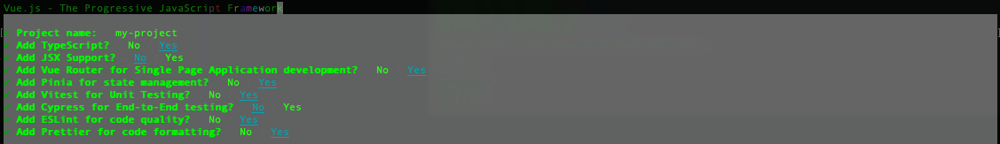
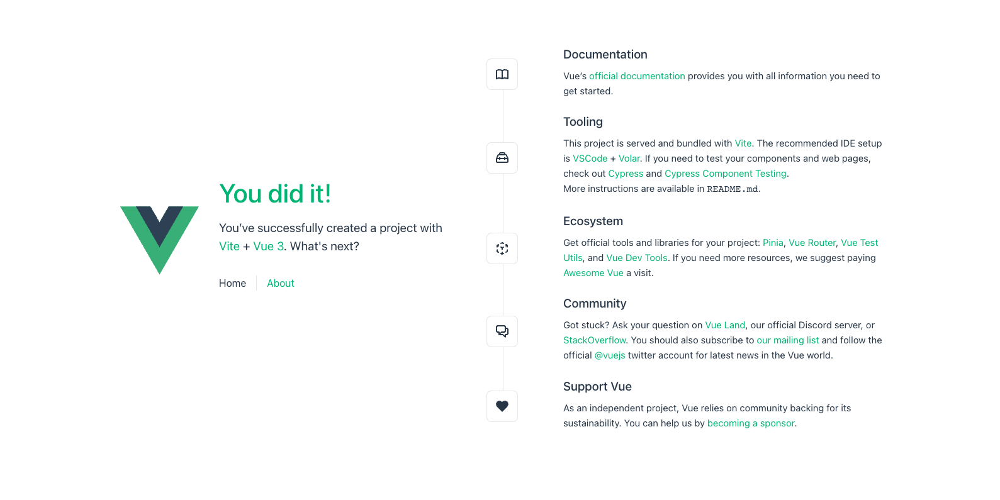

# Шаг 1. Создание проекта в терминале

Откройте терминал и перейдите в директорию, где планируете создать проект. Путь будет зависеть от используемой операционной системы. Например, на unix-подобной системе потребуется выполнить следующие шаги.

Переходим в рабочую директорию `projects`, расположенную в домашней папке пользователя в каталоге `Documents`.

```bash
cd ~/Documents/project
```

Вы можете выбрать любое удобное расположение для хранения исходного кода.

Создаём новый проект:

```bash
mkdir my-awesome-vue-project
cd my-awesome-vue-project
```

Этими командами мы создали новую директорию и перешли в неё.

Далее выполните команду:

```bash
npm init vue@latest
```

Эта команда установит и запустит пакет `create-vue` — официальный мастер настройки новых проектов от команды Vue.

Программа предложит ответить на несколько вопросов для конфигурации нового проекта.



После ответов на все вопросы будет создана директория с именем вашего проекта. Перейдите в неё командой:

```bash
cd my-project
```

# Шаг 2. Установка зависимостей и запуск проекта

Теперь необходимо установить зависимости. Выполните команду:

```bash
npm install
```

Или её сокращённый вариант:

```bash
npm i
```

Зависимости будут установлены в директорию `node_modules`, а также появится файл `package-lock.json`.

Для запуска проекта введите команду:

```bash
npm run dev
```

После запуска проект будет доступен в браузере по адресу `http://localhost:3000/`.


