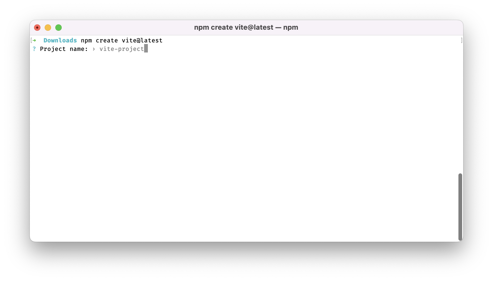
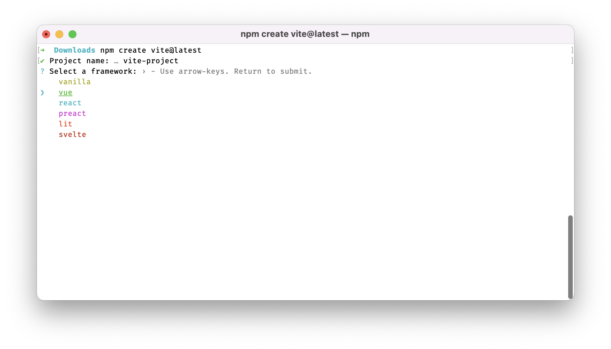
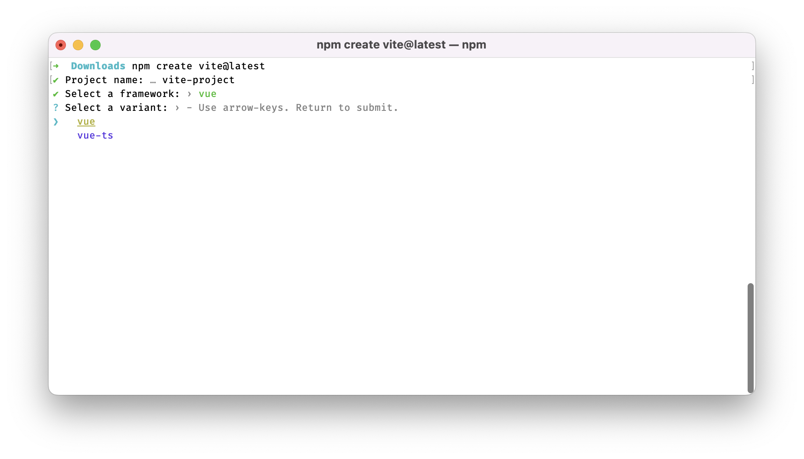
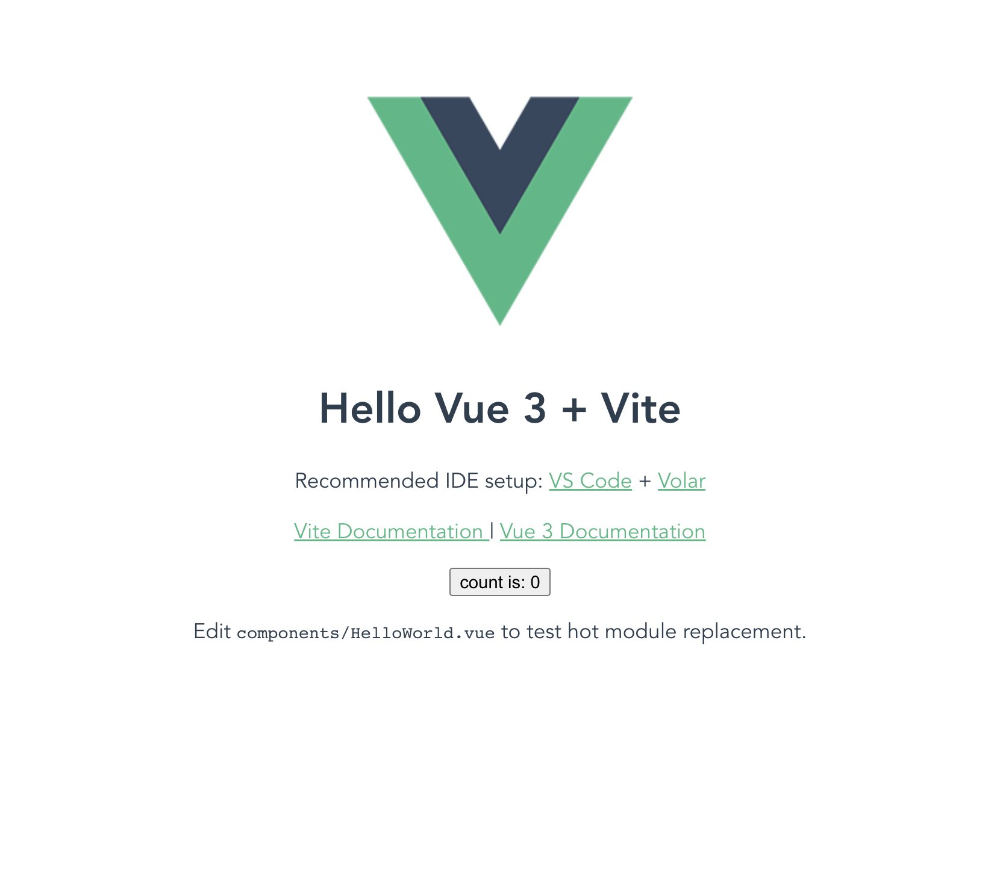

# Шаг 1. Создание нового проекта с помощью Vite.js

В отличие от Vue 2, где применялся webpack, третья версия фреймворка по умолчанию использует сборщик Vite.js.

Для создания нового проекта выполните команду:

```bash
npm create vite@latest
```

Откроется интерактивное окно, в котором можно пошагово задать параметры проекта. Вводим имя проекта — по умолчанию это vite-project:



Затем выбираем базовый фреймворк — в нашем случае это Vue.



Далее можно подключить TypeScript.



Проект создан.

Теперь перейдите в директорию проекта и установите зависимости:

```bash
npm install
```

В отличие от Vue cli, Vite не добавляет дополнительные пакеты автоматически, поэтому их потребуется установить отдельно.

# Шаг 2. Запуск проекта

Запустить проект в режиме разработки можно командой:

```bash
npm run dev
```

После её выполнения запустится локальный сервер, который по умолчанию использует порт `3000`. Проект станет доступен в браузере по адресу `localhost:3000`.



# Шаг 3. Установка дополнительных зависимостей

В качестве маршрутизатора используется пакет vue-router — он является стандартным решением. Мы будем применять его как в учебном, так и в личном проекте.

Для менеджера состояния в третьей версии Vue рекомендуется Pinia, тогда как для второй версии предпочтительнее был Vuex.

Для работы со стилями в наших проектах используется препроцессор Sass.

Для установки маршрутизатора, препроцессора стилей и менеджера состояния выполните следующую команду в директории проекта:

```bash
npm i vue-router sass pinia
```

# Шаг 4. Настройка алиасов (псевдонимов) для путей

Хорошей практикой считается импорт компонентов и функций от единой отправной точки, например директории `src`. Однако при глубокой вложенности директорий путь импорта может выглядеть громоздко:

```jsx
import Component from '../../../../../../src/components/Component.vue'
```

Обратите внимание: путь является относительным и содержит множество ссылок на родительские директории.

> Не ищите этот компонент в коде, это всего лишь пример.

В подобных ситуациях можно настроить Vite так, чтобы он «пометил» директорию `src` специальным символом — обычно используется `@` или `~`. Для этого в файле `vite.config.js` необходимо добавить следующее:

```jsx
/* Добавляем необходимый импорт */
import * as path from 'path'

export default defineConfig({
  plugins: [vue()],

  /* Добавляем опцию для поиска путей */
  resolve: {
    alias: {
      /* Указываем символ "@" как псевдоним для пути к директории "./src" */
      '@': path.resolve(__dirname, 'src')
    }
  }
})
```

Теперь импорт из примера можно упростить до:

```jsx
import Component from '@/components/Component.vue'
```

Обратите внимание, насколько короче стал путь. При встрече символа `@` Vite подставляет путь к директории `src` и корректно выполняет импорт компонента.
