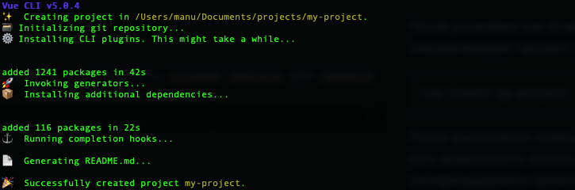
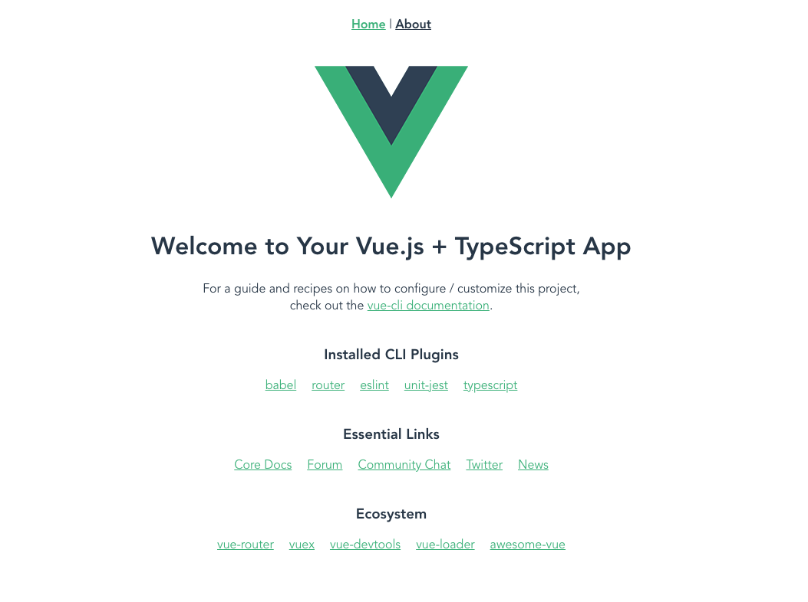

# Шаг 1. Установка Vue cli

Vue cli (command line interface) — утилита, позволяющая разработчику быстро развернуть новый проект с необходимыми зависимостями. В отличие от Vue init и Vite-установщиков, которые запускают проект с помощью Vite, Vue cli построен на базе Webpack.

Подробнее об отличиях Webpack и Vite можно прочитать [здесь](https://vitejs.dev/guide/why.html).

Vue cli — это не только установщик проектов, но и инструмент, обеспечивающий корректную работу различных инструментов сборки с настройками по умолчанию. Это позволяет разработчику сосредоточиться на написании приложения, не отвлекаясь на конфигурацию.

Установка Vue cli выполняется глобально с помощью команды:

```bash
npm install -g @vue/cli
```

После установки убедитесь, что всё прошло успешно, выполнив:

```bash
vue --version
```

Как видите, Vue cli добавляет в терминал команду `vue`, которую можно использовать для создания и настройки проектов.

# Шаг 2. Создание проекта с помощью Vue cli

После установки Vue cli доступна команда `vue create`, запускающая процесс инициализации проекта. Аргументом команды является название проекта.

```bash
vue create my-project
```

После выполнения команды откроется мастер конфигурации. Вы можете воспользоваться готовыми пресетами для Vue 2 или Vue 3, а также настроить проект вручную.

После выбора конфигурации начнётся создание проекта и установка зависимостей.



Для запуска проекта перейдите в его директорию:

```bash
cd my-project
```

И запустите проект командой:

```bash
npm run serve
```

Проект откроется в браузере по адресу [http://localhost:8080/](http://localhost:8080/)


