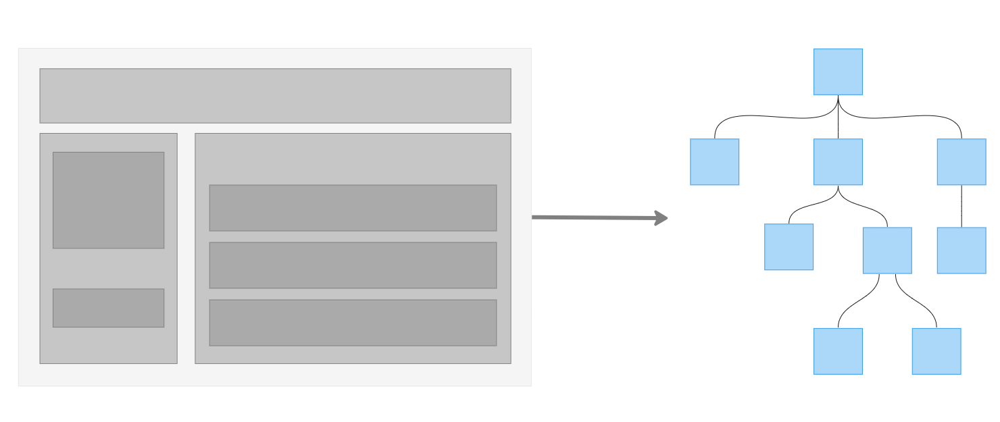

# Дерево компонентов. Однофайловые компоненты

Чтобы лучше разобраться в более сложных аспектах Vue.js — создании проектов и работе с однофайловыми компонентами (SFC) — рассмотрим ключевой элемент фреймворка: **экземпляр Vue**. Он управляет всем приложением и создаётся с помощью функции `createApp`:

```javascript
import { createApp } from 'vue'

const app = createApp(...)
```

Сам по себе этот экземпляр делает немного — фактически ничего видимого: если открыть веб-страницу такого «приложения», на экране ничего не появится. Тем не менее Vue уже инициализирован и готов к использованию.

По традиции экземпляр Vue называют vm (сокращение от `ViewModel`) — хотя фреймворк не полностью реализует паттерн MVVM, его архитектура вдохновлена этим подходом. Подробнее про MVVM можно прочитать [здесь](https://habr.com/ru/articles/338518/).

## Component Decomposition

Приложение Vue, как правило, строится на основе паттерна Component Decomposition с корневым экземпляром Vue, созданным через `createApp`.

Component decomposition — это подход к разделению пользовательского интерфейса на отдельные компоненты ради упрощения управления, повторного использования кода и логичной организации приложения. Этот подход лежит в основе многих современных фронтенд-фреймворков и библиотек: React, Vue, Angular и других.

Ключевые принципы Component Decomposition:

1.  **Компоненты**. Компоненты — это самостоятельные блоки кода, выполняющие определённые функции в интерфейсе. Это могут быть кнопки, формы, карточки, заголовки и другие элементы. Каждый компонент может иметь собственную структуру, стили, поведение и данные.

2.  **Повторное использование**. Компоненты проектируются так, чтобы их можно было использовать повторно на различных страницах и в разных частях приложения. Это помогает избежать дублирования кода и упрощает его сопровождение.

3.  **Изолированность**. Каждый компонент работает независимо, обладает собственными зависимостями и может быть протестирован изолированно. Это обеспечивает возможность изменять один компонент без влияния на остальные.

4.  **Композиция**. Компоненты можно объединять в более крупные компоненты или макеты для использования на различных уровнях приложения. Такой процесс называется композицией компонентов.

5.  **Ясность и поддерживаемость**. Данный подход улучшает читаемость и понимание кода. Компоненты обычно имеют чётко определённый интерфейс и ответственность, что облегчает их разработку и поддержку.

## Дерево компонентов

Приложение можно представить в виде дерева компонентов. В нём могут быть компоненты заголовка, боковой панели, зоны контента. Каждый из них может включать вложенные компоненты — навигационные ссылки, посты блога и так далее.



Каждый компонент Vue размещается в отдельном файле с расширением `.vue` и состоит из трёх ключевых частей:

*   шаблон (`template`);
*   скрипт (`script`);
*   стили (`style`).

Вместе они формируют **Однофайловый компонент (SFC)** — весь код, относящийся к компоненту, хранится в одном файле.

Благодаря **SFC** код разделяется не по типу (HTML, JS и CSS), а по ответственности, что делает его более понятным и удобным в сопровождении.

В Vue 3 появился ряд изменений в однофайловых компонентах по сравнению со второй версией.

## Множественные корневые элементы компонента

Допустим, компонент содержит два блока `<div></div>`. Во Vue 2 пришлось бы обернуть их в дополнительный элемент, например ещё один `<div></div>`, поскольку фреймворк не допускал несколько элементов на верхнем уровне шаблона.

```xml
<!-- Vue 2 -->
<template>
  <div>
    <div>
      Блок 1
    </div>

    <div>
      Блок 2
    </div>
  </div>
</template>
```

Vue 3 лишён этого ограничения и позволяет свободно размещать несколько корневых элементов.

```xml
<!-- Vue 3 -->
<template>
  <div>
    Блок 1
  </div>

  <div>
    Блок 2
  </div>

  <!-- и ещё много других блоков -->
</template>
```

## Composition API «из коробки»

Версии Vue 2 до 2.7 не включали Composition API и требовали установки отдельного плагина. О Composition API мы поговорим подробнее далее, а пока достаточно запомнить, что в Vue 3 Composition API доступен по умолчанию.

## Script setup

Блок `<script>` теперь поддерживает директиву `setup` — синтаксический сахар для написания компонентов с использованием Composition API. Использование `<script setup>` позволяет писать компоненты в формате, максимально приближенном к обычному JavaScript.

Обо всех этих изменениях мы подробно расскажем в последующих статьях.

## Песочницы

Можно практиковаться и экспериментировать с компонентами Vue без необходимости создавать новый проект. Для этого существуют различные онлайн-песочницы, среди которых рекомендуем:

*   [Vue SFC Playground](https://sfc.vuejs.org/),
*   [CodeSandbox](https://codesandbox.io/).

## Гид по написанию компонентов

Обязательно ознакомьтесь с официальным [гидом по написанию компонентов](https://vuejs.org/style-guide/) и держите его под рукой.
