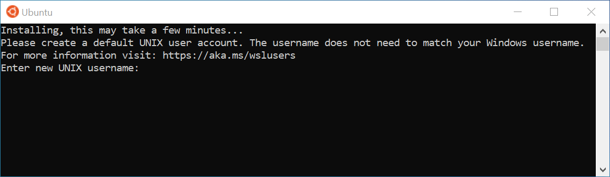
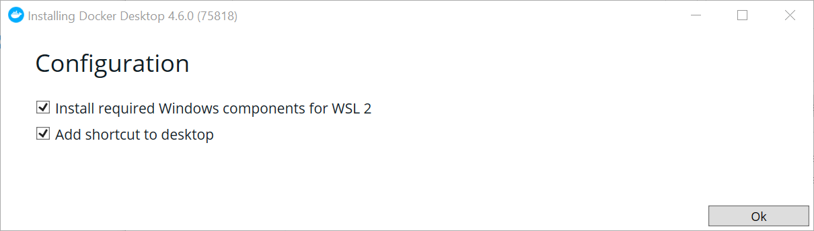
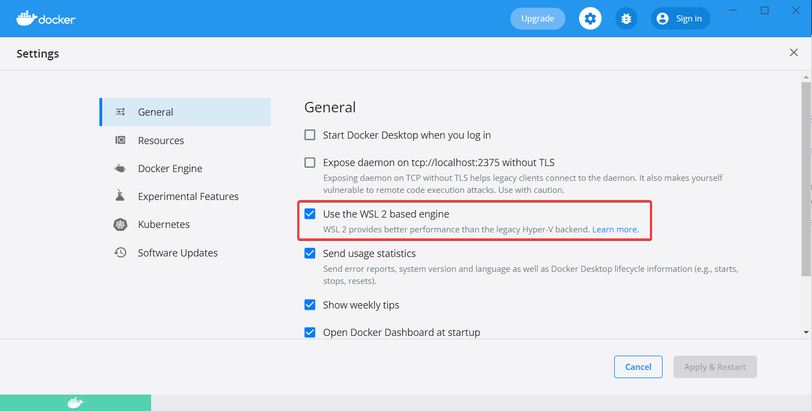
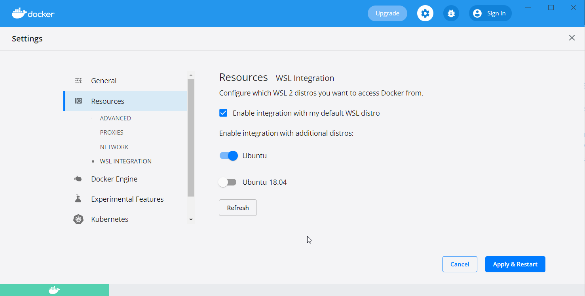
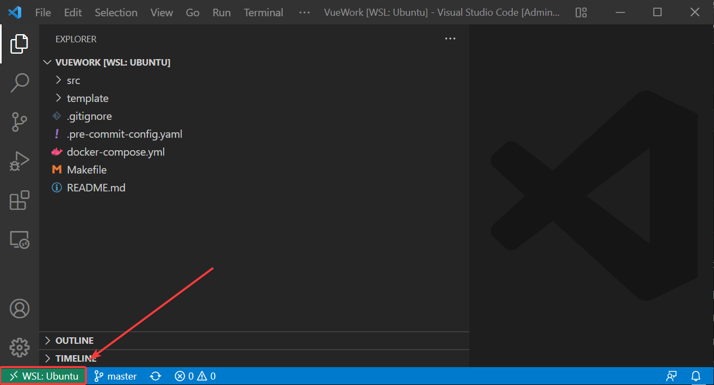
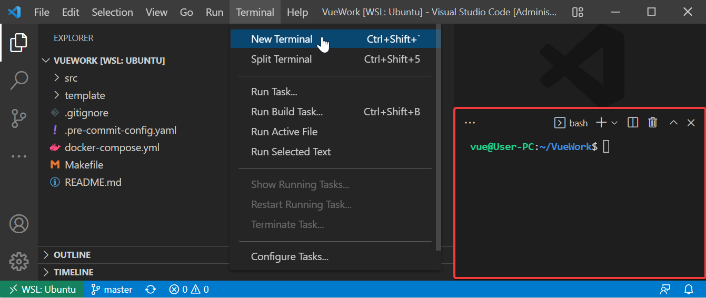

# Шаг 1. Установка docker на Windows

**Внимание**

Пропустите эту инструкцию, если вы пользователь Unix или планируете использовать удалённый сервер.

Установку docker на Windows рассмотрим отдельно, поскольку предварительно необходимо установить [подсистему Windows для Linux (WSL)](https://docs.microsoft.com/ru-ru/windows/wsl/about). Для работы на курсе потребуется вторая версия WSL — [WSL2](https://docs.microsoft.com/ru-ru/windows/wsl/about#what-is-wsl-2).

Об отличиях WSL 1 и WSL 2 можно прочитать [здесь](https://docs.microsoft.com/ru-ru/windows/wsl/compare-versions).

## Системные требования

*   Windows 11 64-bit:
    *   Home или Pro версии 21H2 и выше,
    *   Enterprise или Education версии 21H2 и выше.
*   Windows 10 64-bit:
    *   Home или Pro 2004 (сборка 19041) и выше,
    *   Enterprise или Education 1909 (сборка 18363) и выше.

## Аппаратные требования

*   64-битный процессор с поддержкой технологии [SLAT](https://ru.wikipedia.org/wiki/SLAT).
*   4 Гб оперативной памяти.
*   Включённая аппаратная виртуализация на уровне BIOS.

# Шаг 2. Установка подсистемы Windows для Linux (WSL2)

Если у вас уже установлена WSL1, [обновите её до WSL2](https://docs.microsoft.com/ru-ru/windows/wsl/install#upgrade-version-from-wsl-1-to-wsl-2).

Далее рассмотрим процесс установки WSL2 для различных версий Windows, который также описан в [официальной документации](https://docs.microsoft.com/ru-ru/windows/wsl/install).

Если в процессе возникнет ошибка, проверьте — возможно, её решение уже описано в [документации](https://docs.microsoft.com/ru-ru/windows/wsl/troubleshooting).

## Автоматическая установка

Это рекомендуемый способ. Используйте его при наличии Windows 10 версии 2004 и выше (сборка 19041 и выше) или Windows 11.

Откройте PowerShell от имени администратора и выполните:

```
wsl --install
```

Выполнение команды занимает некоторое время. По завершении перезагрузите Windows. После перезагрузки автоматически начнётся установка дистрибутива Linux — в нашем случае Ubuntu последней LTS-версии.

На этом установка завершена — переходите к блоку «Настройка Ubuntu».

## Ручная установка

Сначала убедитесь, что автоматическая установка, описанная выше, вам не подходит.

Для ручной установки WSL2 выполните шаги 1-5, описанные в [этой статье](https://docs.microsoft.com/ru-ru/windows/wsl/install-manual).

На шаге 6 загрузите Ubuntu по [этой ссылке](https://www.microsoft.com/ru-ru/p/ubuntu-on-windows/9nblggh4msv6?activetab=pivot:overviewtab) или найдите «ubuntu» в Microsoft Store и установите первый предложенный вариант.

На этом установка завершена — переходите к блоку «Настройка Ubuntu».

# Шаг 3. Настройка Ubuntu

На этом этапе подготовительные работы завершены, и PowerShell больше не понадобится. На изображении ниже показан запущенный дистрибутив Ubuntu в оболочке Bash — она используется по умолчанию, но при желании её можно заменить на другую. Для удобства далее будем называть её просто **«терминал»**.

Все последующие команды выполняйте именно в этом терминале.



> Рекомендуем закрепить терминал на панели задач для удобства.

Следуя подсказкам системы, введите имя и пароль. Обязательно запомните пароль — он понадобится для выполнения некоторых команд.

Когда первоначальная настройка завершится, обновите систему:

```
sudo apt update && sudo apt upgrade -y
```

_Вставить текст из буфера обмена в терминал можно нажатием правой кнопки мыши_.

# Шаг 4. Установка необходимых для работы пакетов в Ubuntu

Установите Node.js версии 18+ LTS с помощью [nvm](https://github.com/nvm-sh/nvm):

```
curl -o- https://raw.githubusercontent.com/nvm-sh/nvm/v0.39.1/install.sh | bash

export NVM_DIR="$([ -z "${XDG_CONFIG_HOME-}" ] && printf %s "${HOME}/.nvm" || printf %s "${XDG_CONFIG_HOME}/nvm")"
[ -s "$NVM_DIR/nvm.sh" ] && \. "$NVM_DIR/nvm.sh"

nvm install 18
```

Если последняя команда завершается ошибкой, перезапустите терминал и проверьте версию Node.js:

```
node -v
```

Установите Python 3 и менеджер пакетов pip:

```
sudo apt install python3
python3 --version

sudo apt install -y python3-pip
pip3 --version
```

# Шаг 5. Настройка Git и GitHub

В дистрибутиве Ubuntu Git предустановлен. Для проверки выполните:

```
git --version
```

Настраиваем имя и почту пользователя:

_Замените имя John Doe и почту johndoe@example.com на свои данные._

```
git config --global user.name "John Doe"

git config --global user.email johndoe@example.com
```

Установленная через WSL2 Ubuntu фактически является отдельной виртуальной машиной внутри Windows. С точки зрения GitHub это совершенно другое устройство, не связанное с основной системой. Поэтому для работы с удалёнными репозиториями необходимо настроить SSH-ключи. Рассмотрим сначала копирование имеющихся ключей, а затем генерацию новых.

Если в вашей Windows уже есть сгенерированные SSH-ключи и публичный ключ добавлен в GitHub-аккаунт, можно просто скопировать их в Ubuntu. Найдите в Windows директорию `.ssh` и скопируйте её в буфер обмена.

Затем в терминале перейдите в домашнюю директорию командой `cd`. Откройте её в проводнике Windows командой `explorer.exe .` и вставьте скопированное из буфера обмена.

_Аналогичным способом SSH-ключи можно скопировать из другого установленного дистрибутива (при наличии)._

Если первый способ не подходит, можно сгенерировать новые SSH-ключи непосредственно в Ubuntu.

Выполните в терминале команду для генерации SSH-ключей:

```
ssh-keygen
```

В процессе генерации будет предложено изменить стандартные настройки — можно пропустить эти шаги нажатием `Enter`.

Скопируйте публичный ключ в буфер обмена Windows:

```
cat ~/.ssh/id_rsa.pub | clip.exe
```

Осталось добавить этот ключ в настройки вашего GitHub-аккаунта.

# Шаг 6. Установка и настройка Docker Desktop

Если Docker Desktop уже установлен, переходите к пункту «Настройка ранее установленного Docker Desktop».

## Новая установка

[Скачайте](https://www.docker.com/products/docker-desktop) и установите Docker Desktop.

На этапе установки убедитесь, что пункт «Install required Windows components for WSL2» отмечен.



По завершении установки запустите Docker Desktop и дождитесь окончания запуска. После этого проверьте успешность установки, выполнив в терминале:

```
docker -v
```

## Настройка ранее установленного Docker Desktop

Если Docker Desktop уже установлен на вашем компьютере, запустите его и откройте настройки.

На вкладке `General` отметьте пункт «Use the WSL 2 based engine».



Затем перейдите на вкладку `Resources` `>` `WSL INTEGRATION` и выберите дистрибутивы для интеграции Docker.



На изображении для интеграции выбран дистрибутив по умолчанию (Ubuntu), а второй дистрибутив Ubuntu-18.04 не отмечен — команда `docker` в нём работать не будет. Дистрибутив Ubuntu-18.04 приведён для примера: если вы его не устанавливали, он не появится в списке.

После внесения изменений нажмите `Apply & Restart`.

Дождитесь применения настроек, перезапустите терминал и выполните:

```
docker -v
```

# Шаг 7. Установка и настройка VS Code

Для прохождения курса рекомендуем использовать Visual Studio Code, однако вы вправе выбрать любой другой редактор или IDE.

[Скачайте](https://code.visualstudio.com/) и установите VS Code.

Установите в VS Code следующие расширения — они понадобятся далее:

*   [Remote — WSL](https://marketplace.visualstudio.com/items?itemName=ms-vscode-remote.remote-wsl),
*   [Docker](https://marketplace.visualstudio.com/items?itemName=ms-azuretools.vscode-docker),
*   [ESLint](https://marketplace.visualstudio.com/items?itemName=dbaeumer.vscode-eslint),
*   [Volar](https://marketplace.visualstudio.com/items?itemName=Vue.volar).

# Шаг 8. Установка Pre-commit (опционально)

[Официальная документация](https://pre-commit.com/)

Выполните следующие команды в терминале.

Установка пакета:

```
sudo -H pip3 install pre-commit
```

Проверка установки:

```
pre-commit --version
```

Инициализация:

```
pre-commit install
```

Результат: `pre-commit installed at .git/hooks/pre-commit` — после этого каждый коммит будет проходить проверку правил линтинга и автоматическое исправление ошибок.

# Шаг 9. Разворачивание проекта на примере TaskBoard

Работать с проектом следует в файловой системе Linux, то есть проект должен располагаться «внутри» дистрибутива Ubuntu.

Откройте терминал и клонируйте с помощью Git репозиторий TaskBoard. Далее будем считать, что корневая директория проекта называется **TaskBoard**.

Перейдите в неё командой `cd TaskBoard`.

Любую директорию можно открыть в проводнике Windows командой `explorer.exe`, указав после неё путь. Например, `explorer.exe .` откроет в проводнике текущую директорию — в нашем случае TaskBoard.

Аналогичным образом можно открыть проект в VS Code прямо из терминала командой `code .`. Если команда недоступна, перезапустите терминал и попробуйте снова.

Откройте проект в VS Code. В нижнем левом углу должен отображаться значок WSL.



_VS Code позволяет работать с файлами в Ubuntu так же, как если бы они находились в Windows._

Также для работы можно использовать встроенный в VS Code терминал.



_VS Code автоматически определит, что проект открыт внутри WSL2, и создаст новый Bash-терминал_.

# Шаг 10. Установка Frontend и Backend

## Установка Frontend

В терминале из корневой директории:

1.  Перейдите в директорию `cd frontend`
2.  Установите зависимости `npm install`

## Установка Backend

Далее в терминале:

1.  Вернитесь в корневой каталог проекта `cd ..`
2.  Перейдите в директорию `cd backend`
3.  Установите зависимости `npm install`
4.  Вернитесь в корневой каталог `cd ..`

# Шаг 11. Работа с проектом: установка, запуск, просмотр

## Docker-установка проекта

В терминале в корневой директории TaskBoard:

1.  Запустите проект командой `docker-compose up`.
2.  Для остановки нажмите `Ctrl + C`.

## Запуск бэкенда

Склонируйте репозиторий с бэкендом и запустите json-server:

```
git clone https://github.com/EnderWarik/vue-course-backend.git
cd vue-course-backend
docker-compose up
```

API будет доступен по адресу `http://localhost:3000`.
