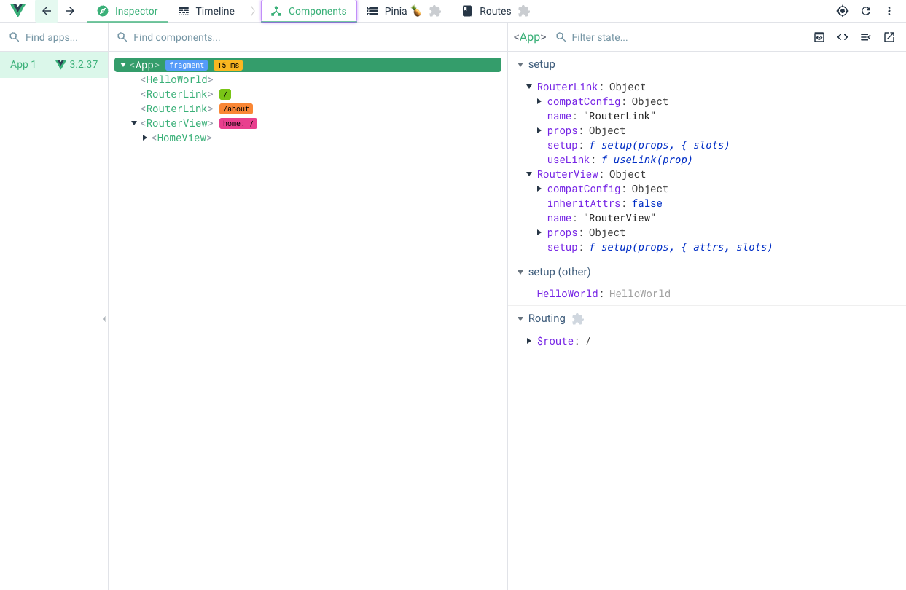
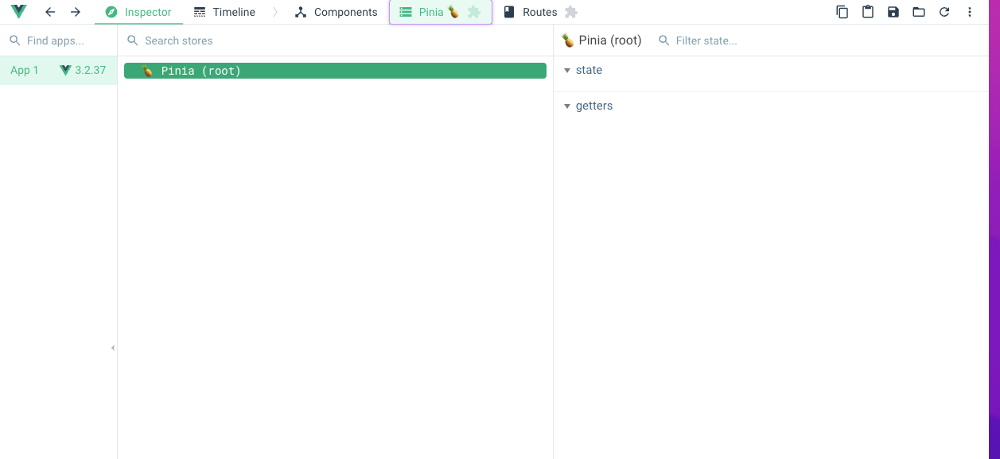
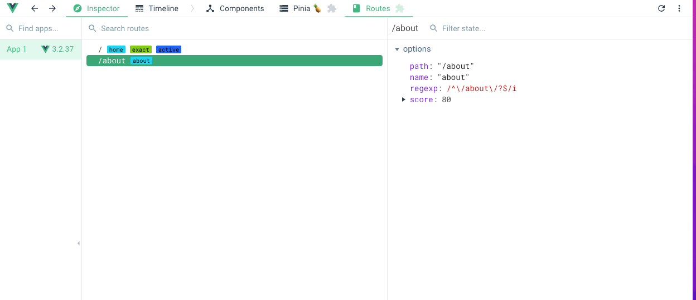
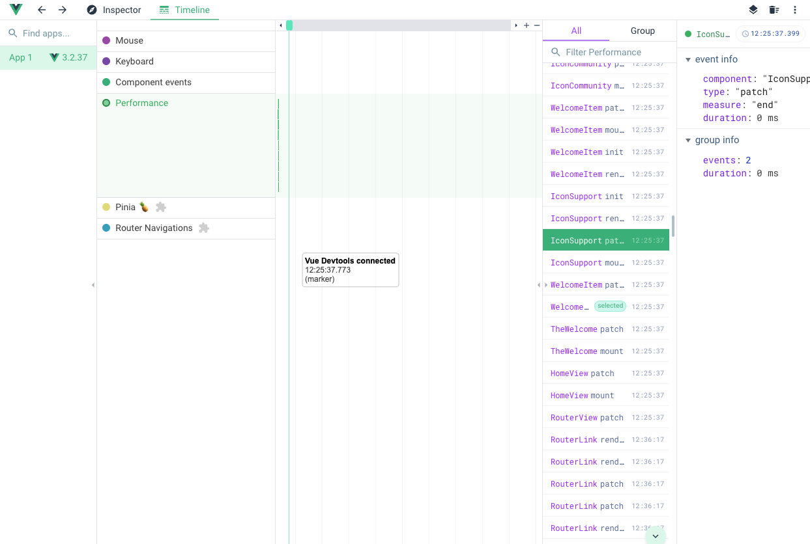

# Работа с Vue Devtools

В процессе разработки Vue.js-проекта компоненты постоянно обновляются, и разработчику приходится внимательно следить за данными, отправленными событиями, переданными параметрами и другими состояниями.

Упростить эту работу помогает инструмент [Vue Devtools](https://github.com/vuejs/vue-devtools). Он функционирует как расширение для браузера. Для пользователей Chrome плагин доступен в [интернет-магазине](https://chrome.google.com/webstore/detail/vuejs-devtools/nhdogjmejiglipccpnnnanhbledajbpd?hl=en). После установки Vue Devtools появится в консоли разработчика в виде отдельной вкладки.

Vue Devtools включает несколько вкладок:

*   инспектор компонентов;
*   инспектор глобального хранилища Pinia;
*   инспектор маршрутов;
*   графики работы приложения (timeline).

## Инспектор компонентов

Дерево компонентов отображает текущую структуру проекта. В корне находится корневой компонент приложения `App.vue`, далее представлены все компоненты, которые в данный момент отрисованы в приложении.

При нажатии на компонент отображаются все его внутренние свойства: данные (data), входные параметры (props), вычисляемые свойства (computed) и другие. Если в настройках предусмотрена соответствующая опция, вы сможете изменять данные прямо в консоли и наблюдать реакцию компонента на изменения.

Пример дерева компонентов:

## Инспектор глобального хранилища Pinia

На этой вкладке можно работать с внутренним хранилищем Pinia. Подробнее о нём мы поговорим в четвёртом разделе.

## Инспектор маршрутов

Вкладка отображает работу маршрутизатора (vue-router). Здесь можно просмотреть все зарегистрированные маршруты.

Подробнее о маршрутизаторе мы поговорим в третьем разделе.

## Графики работы приложения — timeline

На этой вкладке разработчик может детально отследить все изменения в приложении: действия пользователя, производительность, отправленные события и многое другое.

