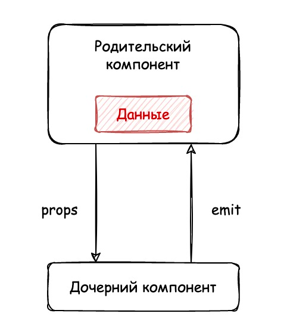
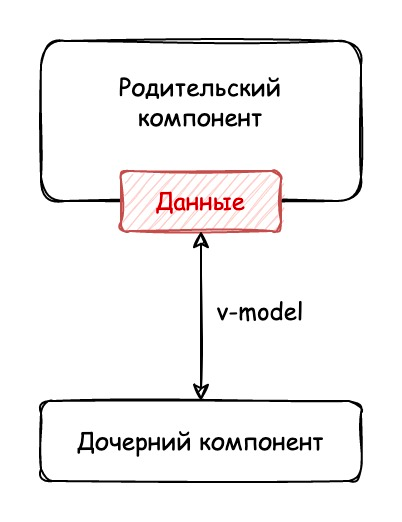

# Использование v-model между компонентами

Ранее мы упоминали, что Vue предоставляет удобную конструкцию для обмена данными и событиями между компонентами.

В предыдущих примерах мы реализовывали одностороннее связывание через связку `props` и `emit`. Схема потока данных выглядела так:



Компоненты при таком подходе выглядели следующим образом:

```xml
<!-- Дочерний компонент -->
<template>
 <div>
   <input
     :value="name"
     @input="emit('setName', $event.target.value)"
   />
 </div>
</template>

<script setup>
  defineProps({
    name: {
      type: String,
      required: true
    }
  })

  const emit = defineEmits(["setName"])
</script>
```

```xml
<!-- Родительский компонент -->
<template>
 <div id="app">
   <Child
     :name="name"
     @setName="setName"
   />
 </div>
</template>

<script setup>
  import { ref } from "vue"
  import Child from "./Child";

  const name = ref("Василий Петров")

  const setName = (value) => {
    name.value = value
  }
</script>
```

Подход работает, однако его можно упростить с помощью директивы `v-model`:



При таком подходе изменение в дочернем компоненте мгновенно обновляет данные в родительском — в нашем случае речь идёт о вводе текста. И наоборот: если данные меняются в родителе, обновления отразятся в потомке.

Чтобы понять, как реализовать такое поведение, нужно разобраться в механике `v-model`. Директива обеспечивает двустороннее связывание данных, но под капотом это всё та же односторонняя передача, обёрнутая в дополнительный слой абстракции.

Для HTML-элементов `<input>` запись:

```xml
<input v-model="value" />
```

...эквивалентна следующей:

```xml
<input
  :value="value"
  @input="value = $event.target.value"
/>
```

Для пользовательских компонентов запись:

```xml
<custom-component v-model="value" />
```

...равнозначна:

```xml
<custom-component
  :modelValue="value"
  @update:model-value="value = $event"
/>
```

Чтобы это заработало на практике, необходимо:

1.  Указать в `props` дочернего компонента свойство `modelValue` и привязать его к атрибуту `value` поля ввода.
2.  При событии `input` вызвать `emit("update:modelValue", значение)`.

```xml
<!-- Дочерний компонент -->
<template>
 <div>
   <input
     :value="modelValue"
     @input="emit('update:modelValue', $event.target.value)"
   />
 </div>
</template>

<script setup>
  defineProps({
    modelValue: {
      type: String,
      required: true,
    }
  })

  const emit = defineEmits(["update:modelValue"])
</script>
```

```xml
<!-- Родительский компонент -->
<template>
 <div id="app">
   <Child v-model="name" />
 </div>
</template>

<script setup>
  import { ref } from "vue"
  import Child from "./Child";

  const name = ref("Василий Петров")
</script>
```

Существует ещё один способ реализовать двустороннее связывание — через `computed` с методами `get` и `set`. Метод `get` возвращает значение `modelValue`, а `set` отправляет соответствующее событие. При этом на самом элементе `<input>` также можно использовать `v-model`:

```xml
<!-- Дочерний компонент -->
<template>
 <div>
   <input v-model="value" />
 </div>
</template>

<script setup>
  import { computed } from "vue"

  const props = defineProps({
    modelValue: {
      type: String,
      required: true,
    }
  })

  const emit = defineEmits(["update:modelValue"])

  const value = computed({
    get() {
      return props.modelValue
    },
    set(value) {
      emit("update:modelValue", value)
    }
  })
</script>
```
