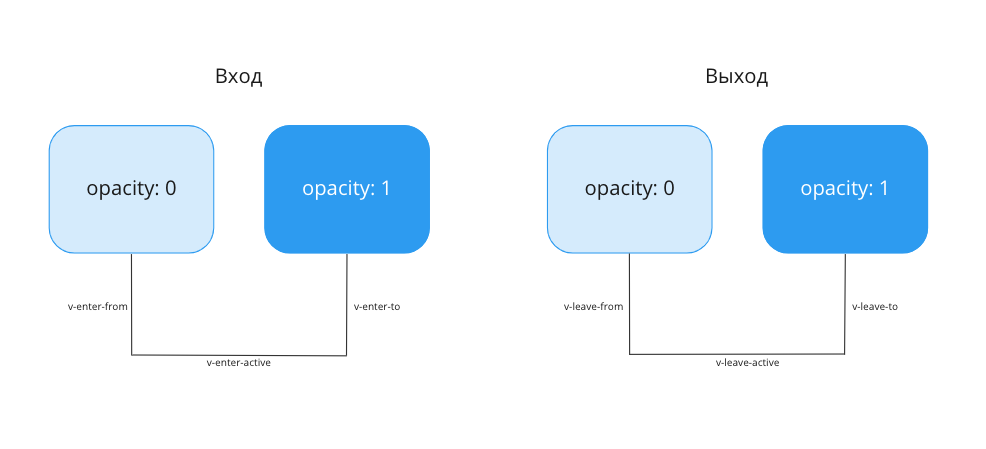

# Хуки анимаций

В предыдущем уроке мы познакомились с несколькими примерами переходов, и вы могли обратить внимание на необычные названия CSS-классов.

Каждый CSS-класс для переходов и анимаций формируется по схеме: `{префикс}`\-`{специальный класс анимации}`. К примеру, `slide-enter-active` складывается из именованного префикса `slide` и специального класса `enter-active`.

Специальные классы делятся на две группы: для появляющегося элемента и для уходящего.

**Классы для появляющегося элемента:**

*   `enter-from` — начальное состояние элемента при появлении. Применяется до вставки элемента в DOM и снимается через один кадр после вставки.
*   `enter-active` — активное состояние на протяжении всей фазы появления.
*   `enter-to` — конечное состояние появляющегося элемента. Добавляется одновременно с удалением класса `enter-from` и снимается по завершении перехода.

**Классы для уходящего элемента:**

*   `leave-from` — начальное состояние уходящего элемента. Устанавливается при срабатывании перехода.
*   `leave-active` — активное состояние, действующее на всём протяжении фазы ухода.
*   `leave-to` — конечное состояние уходящего элемента. Добавляется одновременно с удалением класса `leave-from` и снимается после завершения перехода.

Диаграмма перехода:



Итого для каждого элемента (входящего и уходящего) можно выделить три фазы:

1.  Начальное состояние — снимается сразу после старта перехода (на следующем кадре).
2.  Активное состояние — действует на протяжении всего цикла перехода или анимации.
3.  Завершающее состояние — заменяет начальное и сохраняется до окончания перехода.

## JavaScript-хуки

Помимо декларативного описания анимаций через CSS, Vue позволяет подписаться на события, которые срабатывают на различных этапах жизненного цикла анимации.

Полный перечень доступных хуков:

*   `@before-enter` — срабатывает перед добавлением элемента в DOM.
*   `@enter` — срабатывает через один кадр после добавления элемента.
*   `@after-enter` — срабатывает по завершении перехода появления.
*   `@enter-cancelled` — срабатывает при отмене перехода появления.
*   `@before-leave` — срабатывает перед началом перехода удаления. В большинстве случаев предпочтительнее использовать `@leave`.
*   `@leave` — срабатывает при начале перехода удаления элемента.
*   `@after-leave` — срабатывает после завершения перехода и удаления элемента из DOM.
*   `@leave-cancelled` — срабатывает при отмене перехода удаления (работает только совместно с `v-show`).

Эти хуки можно применять как совместно с CSS-переходами, так и без них.

Если анимация реализуется исключительно средствами JavaScript, рекомендуется добавить компоненту анимации свойство `:css="false"`. Это немного повысит производительность и поможет избежать непредвиденных конфликтов с CSS-правилами.

```xml
<transition
  ...
  :css="false"
>
  <!-- Компонент -->
</transition>
```

В следующих демонстрациях мы увидим, как вся эта теория реализуется на практике.
