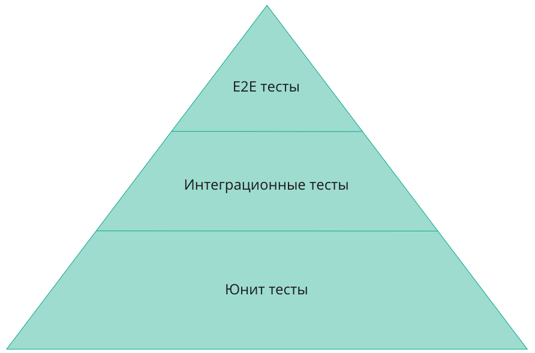

# Зачем нужно тестирование

На начальном этапе работы над проектом необходимость тестов может быть неочевидна. Однако с ростом кодовой базы всё труднее гарантировать отсутствие ошибок. Проект развивается, команда расширяется, разработчики параллельно работают над разными модулями — и вероятность того, что очередное обновление сломает что-то в другой части приложения, становится весьма высокой.

Тесты повышают надёжность веб-приложения, поэтому при каждом обновлении полезно автоматически проверять, что всё продолжает работать как ожидается.

Классическая пирамида тестирования включает три уровня:

*   модульные (unit) тесты;
*   интеграционные тесты;
*   тесты пользовательского интерфейса (e2e-тесты).

**Модульные** (юнит) тесты проверяют работу отдельного модуля в изоляции. В контексте Vue-приложения это, как правило, тестирование компонентов — его также называют компонентным тестированием. Юнит-тесты составляют основу пирамиды, и именно их мы будем писать для нашего приложения. Помимо контроля надёжности, модульные тесты выполняют роль живой документации компонента: по тесту можно понять, какие входные параметры принимает компонент, как он взаимодействует с хранилищем, какие действия ожидаются от пользователя, а также какие существуют ограничения и узкие места.

**Интеграционные тесты** проверяют взаимодействие нескольких частей приложения между собой — например, работу компонента совместно с другими компонентами и хранилищем.

**Тесты пользовательского интерфейса** (e2e) проверяют сценарии взаимодействия пользователя с приложением от начала до конца.
