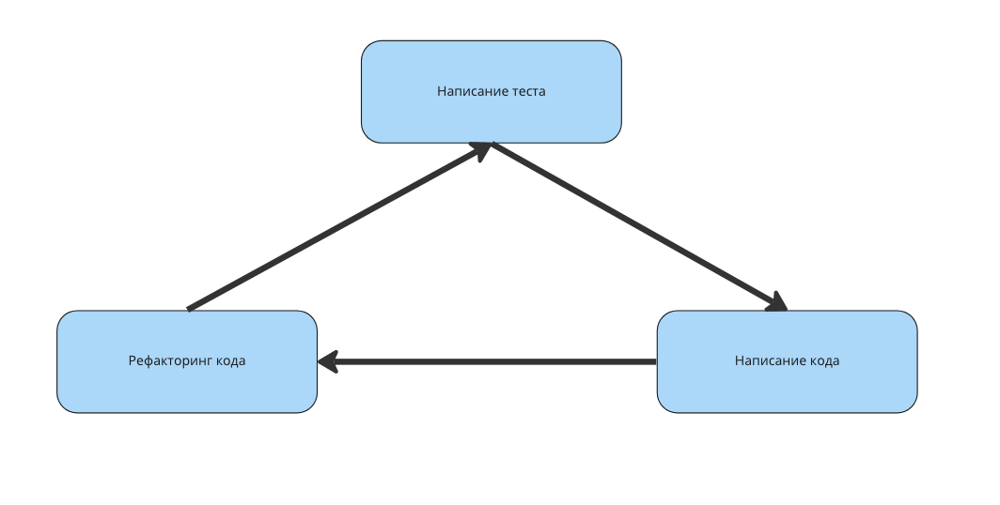

# Программирование через тестирование

Разработка через тестирование (Test Driven Development, TDD) — это методика создания ПО, при которой разработчик сначала описывает в тестах ожидаемое поведение кода, затем пишет реализацию, удовлетворяющую тестам, и в завершение проводит рефакторинг.

## Написание теста

На этом этапе в тесте фиксируется желаемая функциональность: например, что отображается заголовок или что нажатие кнопки вызывает определённое действие. После написания тестов они должны падать — ведь реализации пока не существует.

## Фиксация теста

На втором шаге мы пишем минимально необходимый код, чтобы тесты начали проходить. Качество кода на этом этапе второстепенно — главное, чтобы все проверки были успешными.

## Рефакторинг кода

Заключительный шаг — оптимизация и улучшение написанного кода при сохранении зелёных тестов.

## Преимущества TDD

**Высокое покрытие кода тестами.** Поскольку тесты создаются до кода, практически вся кодовая база оказывается покрытой. При этом не нужно возвращаться к написанию тестов постфактум.

**Более качественный код.** На этапе рефакторинга разработчик полностью понимает назначение каждого фрагмента, что способствует улучшению архитектуры и читаемости.

**Раннее обнаружение ошибок.** Автоматизированные тесты выявляют проблемы на ранней стадии, когда их исправление обходится дешевле всего.

**Тесты как документация.** Тесты описывают конкретные возможности и ограничения каждого элемента системы, что помогает быстро разобраться в функциональности компонента.
